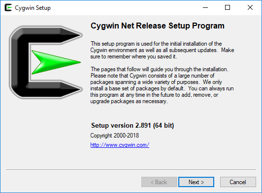
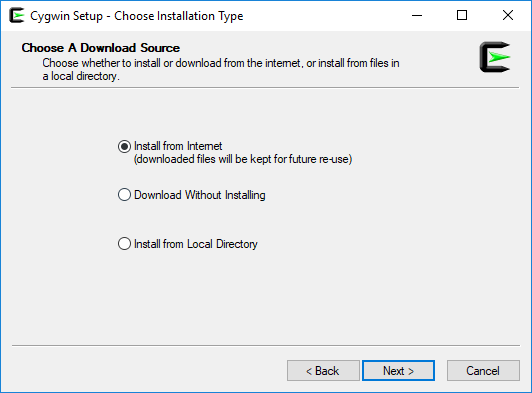
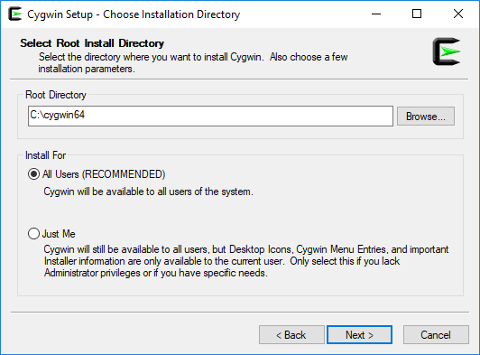
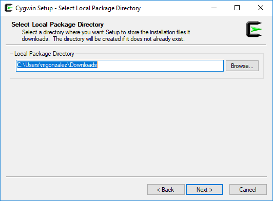
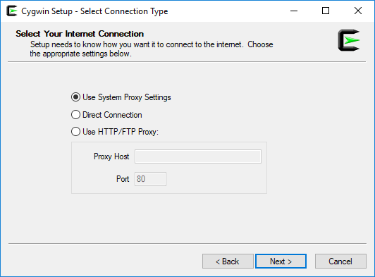
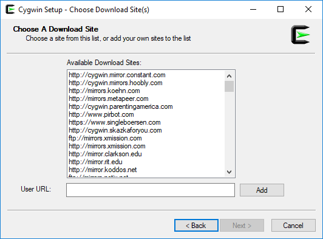
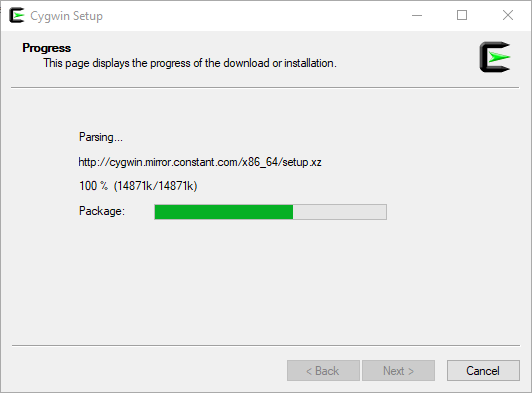

# GRAPHHOPPER & OSM
  
GraphHopper is a fast and memory efficient Java routing engine released under Apache License 2.0. Per default it uses OpenStreetMap and GTFS data but can import other data sources.

## 0.Prerequisites
### 0.1. Cygwin
Download and execute the installer. Keep defaults.  
  
  
  
  
  
 At `Choose a Download Site` section, select any mirror.  
   
   
We need to install `wget` (web category), `git` (devel category) and `unzip` (archive category) on the setup.  

### 0.2. Java JDK
Make sure we have the latest JDK installed and not only JRE. If not, go to [this site](https://sourceforge.net/projects/openjdkportable/), download it and extract in your `Java` directory.  
After that, make sure you have `JAVA_HOME` path working with your `JDK` directory. If not, just do:
```cmd
export JAVA_HOME=working/directory/of/jdk
```
### 0.3. OSM pbf file
Go to [GeoFabrik](https://download.geofabrik.de/) and download the file that you want, `as .pbf file`. In this case we will be working with [Poland](http://download.geofabrik.de/europe/poland-latest.osm.pbf).

## 1.START UP
Go to your development are with `Cygwin` shell. Get the project using git: `git clone https://github.com/graphhopper/graphhopper.git`.
Go into `graphhopper` root, and execute this command:
`./graphhopper.sh -a web -i osm-file.pbf`.  
  
Then go to http://localhost:8989 to start working with it:
  
Also works with addresses:
  
