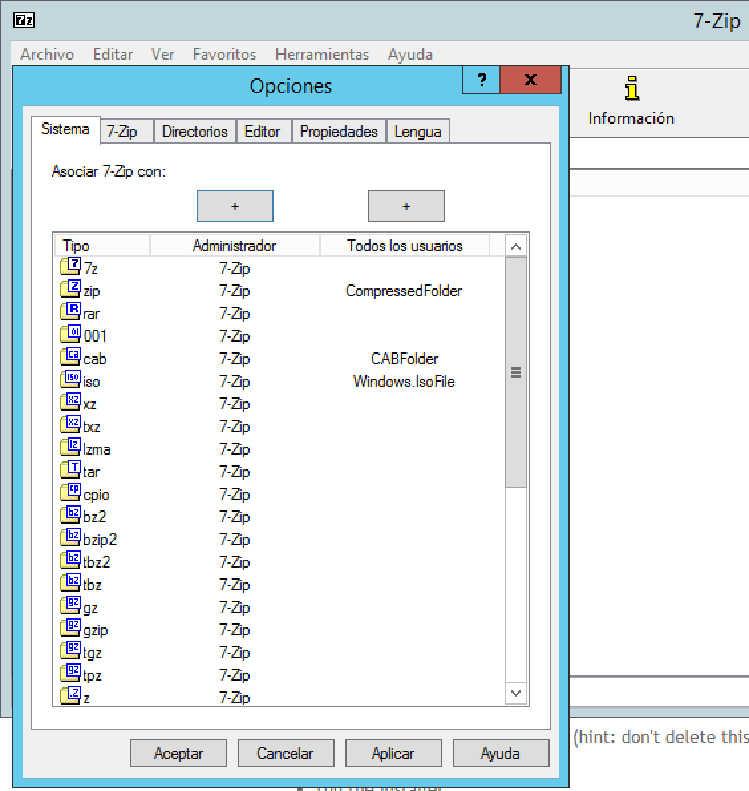

# OpenStreeMap & Windows Server


### Prerequisites
* #### Microsoft Visual C++ 2015

* #### Microsoft Visual C++ 2012

* #### Microsoft Visual C++ 2012

* #### Microsoft Visual C++ 2010

* #### 7-zip

## 0. Explanation
This guide will `ONLY` explain how to install a TMS on Windows 2012 server machine, also works on W7.

Create OSM tile server require:
* Database
* Data from OSM
* Importing data into database
* Generating tiles from Database

## 1. Install Required Software
### 1.1. 7-zip
We should enable all formats through Tools/Options. Go to `Start Menu -> 7-zip -> 7-zip File Manager`. After this, `bz2` files should automatically open in 7-zip.
  

### 1.2. Cygwin
Download and execute the installer. Keep defaults.
  
  
  
  
  
 At `Choose a Download Site` section, select any mirror.
   
   

##### IMPORTANT
###### Make sure you add the following packages:
```
wget (web)
unzip (archive)
gcc (devel, named "gcc-g++: C++ compiler")
make (devel)
python2 (python)
```

Finish the installation.

### 1.3. Ms4w
Just download the .exe and install it without adding anything else than default parameters.
  
  
  
  

  
  

### 1.4. Git
Install Windows binaries and select `Run Git from the Windows Command Prompt`, leave the rest as default.

### 1.5. PostgreSQL
We must download a version over 9.2, never below, and double-click on it to launch the installer.
  

#### 1.5.1. Install  PostgreSQL
Just click `Next` through the first few Setup wizard steps.
  
  
  
 We will use `postgres` at password screen.
   
 As a default, PostgreSQL installation sets up both a PostgreSQL superuser named `postgres` and a Windows system user account named `postgres` that will use the same password.
 Click `Next` through the rest of the Setup Wizard.
   
   
   
   
   
 The last step of the Setup wizard should ask if you want to launch `Stack builder`, make sure that the checkbox is checked and finish the installation.
   
On the first page of the `Stack Builder` window, in the drop down, select `PostgreSQL on port 5432`.
  

On the next page, click on the `+` sign next to `Spatial Extensions`.Check the box next to `PostGIS X.X for PostgreSQL your-version`.
  
Click `Next` until presented with the `PostGIS X.X` setup window.
  
  

#### 1.5.2. Install  PostGIS
Start the installer through the `Stack Builder` or the standalone installer. Click on `I Agree`.
  
Make sure `Create Database` is not selected.
  
Click `Next` until you get to a `Database Connection` page.
  
Enter `postgres` for the password and click `Next`.
  
Click `Yes` to the `Would you like us to ... GDAL_DATA...`, yes, yes,....
  
  
  
Click `Finish` in the Stack Builder window.
  

#### 1.5.3. Verify PostgreSQL and PostGIS Installation Success
In your `Start Menu` go to `pgAdmin III`. This should bring up an administrative window, with an `Object Browser` on the left side of the window.
  
Double click on the `PostgreSQL x.x (localhost)` server and enter your password (`postgres`).
Open `Database` tree to look that we have a db called `postgres`.
  

## 2. Create the OSM Database Instance
Lets add the `C:\Program Files\PostgreSQL\XX\bin` directory  to your Path environment variable.
Go to `Start > Control Panel > System > Advanced System Settings > Advanced > Environment Variables`. In the `System Variables` section select the `Path` variable and edit it adding what we said earlier.
  

 Open `pgAdmin III` and create a db named `osm` with the following sql syntax:
 ```sql
 CREATE DATABASE osm OWNER postgres ENCODING 'UTF8';
 ```
 Open a command prompt and enter the following commands:

```cmd
psql -U postgres -d osm -f "C:\Program Files\PostgreSQL\X.X\share\contrib\postgis-2.0\postgis.sql"

psql -U postgres -d osm -f "C:\Program Files\PostgreSQL\X.X\share\contrib\postgis-2.0\spatial_ref_sys.sql"

psql -U postgres -d osm -f "C:\Program Files\PostgreSQL\X.X\share\contrib\postgis-2.0\legacy.sql"
```
We must also apply a patch. Download the patch file to your local machine: [legacy-postgis-gist.sql](https://github.com/downloads/mapserver/docs/legacy-postgis-gist.sql). Then execute in the directory that you downloaded the file to:
```cmd
psql -U postgres -d osm -f "legacy-postgis-gist.sql"

```
Try connecting to the 'osm' database:
```cmd
psql -U postgres -d osm
```


* note: to exit that database connection, type: \q
## 3. MS4W start-up
After installing the software, open a command prompt window and cd to the ms4w directory. Execute `setenv.bat`
Download the Windows binaries from [here](), extract inside our `Program Files` directory and add that directory to our `PATH` environment variable.


Lets test MapServer by calling the CGI executable, with the command: `mapserv -v` which should return some information about it, just something like:
  
Also we need to install Apache. Execute the following command in that same window: `apache-install.bat`.
Finally open your Web browser (Firefox, Chrome, or Internet Explorer) and goto http://127.0.0.1
  

## 4. Preparing working directory
Create a new folder for all of our working files, inside the C:/ms4w/apps directory, and name it: `osm`. Inside the C:/ms4w/apps/osm directory, also create a `data` folder.

## 5. Obtaining OSM Data
You have several choices/options for how to obtain the OSM data. Save the file inside the data directory: `C:/ms4w/apps/osm/data`
We have used [this](http://download.geofabrik.de/europe/poland-latest.osm.bz2), Poland.

## 6. Import OSM Data into PostgreSQL

We must add the "population" field to the `osm2pgsql` style file, so open `C:\Program Files\osm2pgsql\default.style`
add the following line at the bottom of that file:

* `node,way   population   text         linear`

  

First we must make sure to use the correct EPSG file, so open a command window and type: `SET PROJ_LIB=C:\ms4w\proj\nad`

Now we must import the OSM data into our 'osm' table, by using the `osm2pgsql`  commandline utility. Execute the following in that same command window, but substitute the bz2 filename with either your .osm file or your own .bz2 file ( use the password: postgres ):

```cmd
osm2pgsql -U postgres -W -m -d osm -p osm -E 3857 -S "C:\Program Files\osm2pgsql\default.style" yourfile.osm.bz2
```
  

Lets verify that the tables were created, by either using pgAdmin III (StartMenu/Programs/PostgreSQL 9.1/pgAdmin III/) or connect to the database through the commandline and display the table names with the command: `psql -U postgres -d osm -c \d` which returns a list of the new tables, such as:
  

## 7. Prepare OSM Tables in PostgreSQL
First we must obtain the `MapServer/Basemaps` code through Git. Open a command window and cd to the directory: `C:/ms4w/apps/osm` and execute the git clone command to cole the `basemaps` repository:

* `git clone https://github.com/mapserver/basemaps.git basemaps`

This package uses the a python script and the c preprocessor to build a complete mapfile from a set of templates and styling information. More info about it [here](https://github.com/mapserver/basemaps).

Now we will use a script to modify our table schema in the osm database: cd to the `/basemaps/contrib/` folder, and then execute: `psql -U postgres -d osm -f "osm2pgsql-to-imposm-schema.sql"`
  

And again, lets verify that the tables were created, by either using pgAdmin III (StartMenu/Programs/PostgreSQL 9.1/pgAdmin III/) or connect to the database through the commandline and display the table names with the command: `psql -U postgres -d osm -c \d`

## 8. Generate the OSM Mapfile.
Configure Basemap Makefiles
First we need to get the extent of our data, so we will use PostGIS in the command window, execute the following: `psql -U postgres -d osm -c "SELECT ST_extent(way) FROM osm_line"`
which will return the extents such as:
  

Next open the file /basemaps/Makefile in Notepad++
add comments to lines 14-16, such as:

  >#OSM_SRID=4326
  #OSM_UNITS=dd
  #OSM_EXTENT=-180 -90 180 90  

change line#19 for our database parameters, such as:
  >OSM_DB_CONNECTION=host=localhost dbname=osm user=postgres password=postgres port=5432  

change line#20 to use the extents returned by our previous PostGIS command, such as:
  >OSM_EXTENT=-8014118.79 5020536.82 -7906037.8 5178887.95

change line#21 so that `EPSG:900913` is removed, such as:
  >OSM_WMS_SRS=EPSG:4326 EPSG:3857 .....

change line#24 so that Google-styled maps are produced, such as:
  >STYLE=google

### Generate the Mapfile
Now we are ready to generate the mapfile.

Through Windows Explorer or a command window, create a new folder 'generated' inside the `C:/ms4w/apps/osm/basemaps` directory.
Open the Cygwin Terminal window,
cd to our working directory: `C:/ms4w/apps/osm/basemaps`
  >cd c:/ms4w/apps/osm/basemaps

execute: `make`

### Prepare Background Data Files
Lets open the `/basemaps/data/Makefile` file. There are two `.zip`. We should download them and extract each one in the same directory: `/basemaps/data`.

Finally we must be sure to create index files (.qix) for each shapfile, so they display fast in MapServer:
in a regular Windows command window, cd to `C:/ms4w/`
execute the following command: `setenv.bat`
now cd to `C:/ms4w/apps/osm/basemaps/data/` directory
execute the following command (warning: it may take a few minutes to generate the index files):
```cmd
for %f in (*.shp) do shptree %f  
```

### Modify osm-google.map

We should make some minor adjustments to the generated mapfile. Open /basemaps/osm-google.map in Notepad++ and:

change ~line#14 to something more descriptive, such as:
  >"wms_title" "Poland OpenStreetMap Service"

change ~line#16 to add the IMAGE parameters configured for MS4W, such as:
  >WEB  
    METADATA  
              ...  
           END  
           IMAGEPATH "/ms4w/tmp/ms_tmp/"  
           IMAGEURL "/ms_tmp/"   
        END

change ~line#20-21 to comment the CONFIG parameter, such as:
        #CONFIG "MS_ERRORFILE" "stderr"
        #CONFIG "PROJ_LIB" "/cygdrive/c/ms4w/apps/osm/basemaps"

## 9. Test the OSM Mapfile.
http://localhost/cgi-bin/mapserv.exe?mode=browse&template=openlayers&layers=all&map=C:/ms4w/apps/osm/basemaps/osm-google.map .

  
