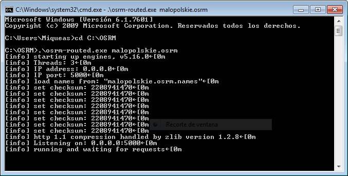

# OSRM
  
The Open Source Routing Machine or OSRM is a C++ implementation of a high-performance routing engine for shortest paths in road networks. Licensed under the permissive 2-clause BSD license, OSRM is a free network service. OSRM supports Linux, FreeBSD, Windows, and Mac OS X platform.

# Installing OSRM on Windows
## 0. Prerequisites
* Release file from [here](http://build.project-osrm.org/). Download `osrm_Release.zip`.
* Frontend file. Download the repository as .zip from [GitHub](http://github.com/Project-OSRM/osrm-frontend).
* Getting the data. I have used [Poland](http://download.geofabrik.de/europe/poland.html). It must be `.pbf` file.  

## 1. Building Project Directory
Open a Command Prompt and go to your local disc and create the Project Directory if not exist.  
-e.g.
```cmd
cd C:\
mkdir osrm
```
Unzip the `Release file` into this folder. Not necessary but highly recommended also create `data` folder into.
```cmd
mkdir data
```
Place the `.pbf` file into `/data` folder.
## 2. Starting Engine
Open a Command Prompt and go to your project directory and use the `extract.exe -p profile.lua, contract.exe and routed.exe` with `./data/file.pbf`.  
e.g.
```
cd C:\osrm\  
.\osrm-extract.exe -p car.lua .\data\poland.osm.pbf
.\osrm-contract.exe .\data\poland.osrm
.\osrm.routed.exe .\data\poland.osrm
```
Now is waiting requests in `localhost:5000`  
e.g.img

#### WARNING!
Depends of the file and the computer take more or less time. Using whole Poland, took me about 23 hours.
