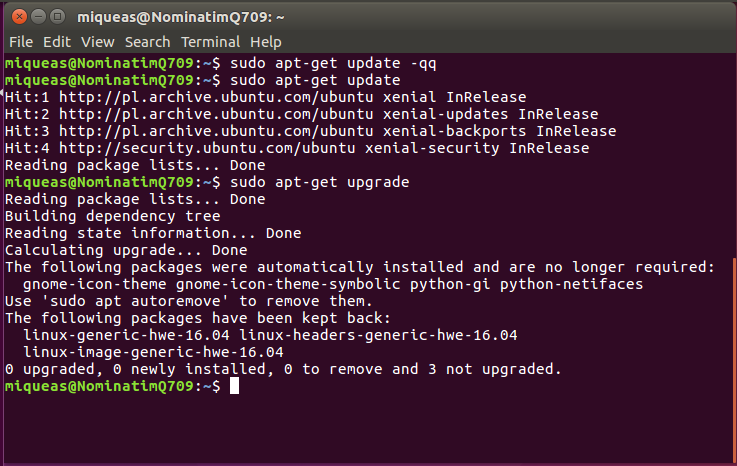

# PHOTON
  
Opensstreetmap wiki:
Photon is an Open Source geocoder ("Name and Address Search") built for OpenStreetMap data. It was originally based on Apache Solr and now on elasticsearch. Photon was developed by komoot.

It provides a Geocoder, which is:

  *  multilingual (currently English and German)
  *  Search-as-you-Type

A public API (as well as their terms of use) is provided on the project [page](https://photon.komoot.de/).

### Features

  *  high performance
  *  highly scalability
  *  search-as-you-type
  *  multilingual search
  *  location bias
  *  typo tolerance
  *  filter by osm tag and value
  *  reverse geocode a coordinate to an address
  *  OSM data import (built upon Nominatim) inclusive continuous updates
### ATTENTION
This guide teach how to install and use Photon on Windows.
## 0. Installation
Photon requires [java](https://www.java.com/inc/BrowserRedirect1.jsp?locale=en), at least version 8. Make sure you have created your work directory like `C:\Photon`
Now get [photon](https://github.com/komoot/photon/releases), at least 0.3, from the releases and paste it on your directory. You must have something like `C:\Photon\photon-version.jar`
At this point you got 2 ways of using photon.
* Worldwide coverage downloading pre-indexed data
* Import data from Nominatim on Ubuntu\Centos machine

## 1. Pre-indexed
Download the search index (53G gb compressed, worldwide coverage, languages: English, German, French and Italian). The search index is updated weekly and thankfully provided by GraphHopper with the support of lonvia.

Make sure you have bzip2 or pbzip2 installed (take a look on [this](https://github.com/Sozhia/Quantum/tree/master/TMS) guide, specially on cygwin [here](https://github.com/Sozhia/Quantum/tree/master/TMS#make-sure-you-add-the-following-packages) and execute one of these two commands in your shell. This will download, uncompress and extract the huge database in one step:
```cmd
wget -O - http://download1.graphhopper.com/public/photon-db-latest.tar.bz2 | bzip2 -cd | tar x
# you can significantly speed up extracting using pbzip2 (recommended):
wget -O - http://download1.graphhopper.com/public/photon-db-latest.tar.bz2 | pbzip2 -cd | tar x
```
### WARNING
`Will take a lot of time, depends of your computer.`

After that execute the `.jar` file :
`java -jar photon-*.jar`  
Check the URL http://localhost:2322/api?q=somewhereyouwant to see if photon is running without problems and you will get something like this GeoJSON.
```JSON
{
  "features": [
    {
      "properties": {
        "name": "Berlin",
        "state": "Berlin",
        "country": "Germany",
        "osm_key": "place",
        "osm_value": "city",
        "osm_type": "N",
        "osm_id": 240109189
      },
      "type": "Feature",
      "geometry": {
        "type": "Point",
        "coordinates": [
          13.3888599,
          52.5170365
        ]
      }
    },
    {
      "properties": {
        "name": "Berlin Olympic Stadium",
        "street": "Olympischer Platz",
        "housenumber": "3",
        "postcode": "14053",
        "state": "Berlin",
        "country": "Germany",
        "osm_key": "leisure",
        "osm_value": "stadium",
        "osm_type": "W",
        "osm_id": 38862723,
        "extent": [
          13.23727,
          52.5157151,
          13.241757,
          52.5135972
        ]
      },
      "type": "Feature",
      "geometry": {
        "type": "Point",
        "coordinates": [
          13.239514674078611,
          52.51467945
        ]
      }
    }]
  }
  ```
  

You may want to use our leaflet plugin to see the results on a map.

## 1.1. Imported data
If you need search data in other languages or restricted to a country you will need to create your search data by your own. So I will explain you how to set up Nominatim server.

## 2. Nominatim Server
You need an Ubuntu Server Working (this example will use 16.04 desktop version).
Make sure all packages are are up-to-date by running:
```bash
sudo apt-get update -qq
```  
  
Now you can install all packages needed for Nominatim:
```bash
sudo apt-get install -y build-essential cmake g++ libboost-dev libboost-system-dev \
                        libboost-filesystem-dev libexpat1-dev zlib1g-dev libxml2-dev\
                        libbz2-dev libpq-dev libproj-dev \
                        postgresql-server-dev-9.5 postgresql-9.5-postgis-2.2 \
                        postgresql-contrib-9.5 \
                        apache2 php php-pgsql libapache2-mod-php php-pear php-db \
                        php-intl
```
### 2.1. System configuration
The following steps are meant to configure a fresh Ubuntu installation for use with Nominatim. You may skip some of the steps if you have your OS already configured.
#### 2.1.1. Creating Dedicated User Accounts
Nominatim will run as a global service on your machine. It is therefore best to install it under its own separate user account. In the following we assume this user is called nominatim and the installation will be in `/srv/nominatim`.  
  
To create the user and directory run:
`sudo useradd -d /srv/nominatim -s /bin/bash -m nominatim`
You may find a more suitable location if you wish.

To be able to copy and paste instructions from this manual, export user name and home directory now like this:
```bash
export USERNAME=nominatim
export USERHOME=/srv/nominatim
```

Make sure that system servers can read from the home directory:
`chmod a+x $USERHOME`

#### 2.1.2. Setting up PostgreSQL

Tune the postgresql configuration, which is located in `/etc/postgresql/9.5/main/postgresql.conf`.  
  
  
As you can see `listen_addresses = '*'` is uncommented.
Now edit `/etc/postgresql/9.5/main/pg_hba.conf` and add this line at the end of the document:
`host all all ip.of.your.server/yourmask md5`.

Finally, we need to add two postgres users: one for the user that does the import and another for the webserver which should access the database for reading only:
```bash
sudo -u postgres createuser -s $USERNAME
sudo -u postgres createuser www-data
```

Restart the postgresql service after updating this config file.

`sudo systemctl restart postgresql`

Check if PostgreSQL is running and listening:
  


## 2.2. Building and Configuration 

Get the source code for the release and change into the source directory
```bash
cd $USERHOME
wget https://nominatim.org/release/Nominatim-3.1.0.tar.bz2
tar xf Nominatim-3.1.0.tar.bz2
cd Nominatim-3.1.0
```
When installing the latest source from github, you also need to download the country grid:
```bash
wget -O data/country_osm_grid.sql.gz https://www.nominatim.org/data/country_grid.sql.gz
```
The code must be built in a separate directory. Create this directory, then configure and build Nominatim in there:
```bash
mkdir build
cd build
cmake ..
make
```

Once you have your nominatim database ready, you can import the data to photon.

## 2.3. Initial import of the data

Download the data to import and load the data with the following command:
```bash
./utils/setup.php --osm-file <data file.osm.pbf> --all --osm2pgsql-cache AMMOUNTOFRAM(never more than 2/3 of RAM available) 2>&1 | tee setup.log
```

The --osm2pgsql-cache parameter is optional but strongly recommended for planet imports. It sets the node cache size for the osm2pgsql import part (see -C parameter in osm2pgsql help). As a rule of thumb, this should be about the same size as the file you are importing but never more than 2/3 of RAM available. If your machine starts swapping reduce the size.

Import the data to photon in Windows machine:
```cmd
java -jar photon-version.jar -nominatim-import -host ipserver -port 5432 -database nominatim -user nominatim -password mysecretpassword -languages es,fr
```

If you haven't already set a password for your nominatim database user, do it now (change user name and password as you like, below) Ubuntu Server:
```bash
su postgres
psql
ALTER USER nominatim WITH ENCRYPTED PASSWORD 'mysecretpassword';
```
